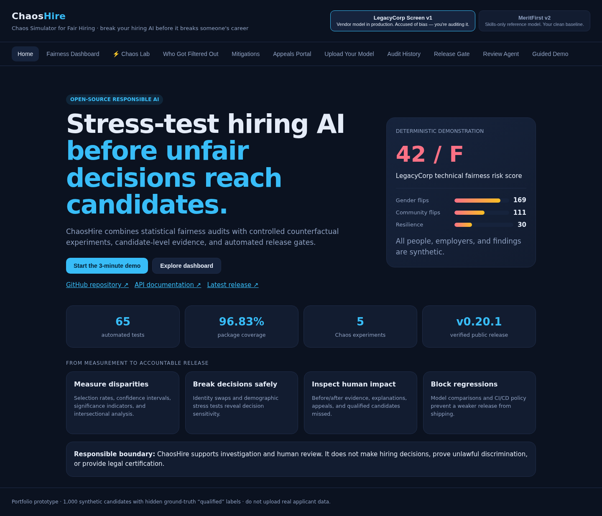

# ChaosHire

### Chaos testing for fair hiring AI

[Live demo](https://chaoshire.onrender.com) · [API docs](https://chaoshire.onrender.com/docs) · [scikit-learn example](docs/SCIKIT-LEARN-INTEGRATION.md) · [Portfolio evidence](docs/PORTFOLIO-EVIDENCE.md) · [Case study](docs/PORTFOLIO-CASE-STUDY.md) · [Architecture](docs/ARCHITECTURE.svg) · [Methodology](docs/METHODOLOGY.md) · [Platform](docs/PORTFOLIO-PLATFORM.md) · [Monitoring](docs/MONITORING.md) · [Roadmap](PROJECT-ROADMAP.md)

> Netflix breaks its own servers to find weaknesses before customers do. ChaosHire applies the same idea to automated hiring decisions: stress the model safely before unfair behavior affects real candidates.



ChaosHire is an open-source fairness-auditing prototype for hiring models. It combines conventional group-fairness metrics with controlled counterfactual experiments, candidate-level explanations, mitigation simulations, and an appeals workflow.

## Why this project exists

A normal fairness dashboard asks, **“Did groups receive different outcomes?”** ChaosHire also asks, **“Would this exact decision change if only the candidate's identity changed?”**

That second question powers the **Chaos Lab**:

| Test | Controlled experiment | Risk exposed |
|---|---|---|
| Gender-swap counterfactual | Change gender markers; leave qualifications unchanged | Direct or proxy gender influence |
| Name/community swap | Change community signals; preserve the résumé | Name or community discrimination |
| Privilege-keyword injection | Submit deliberately weak, prestige-heavy synthetic résumés | Susceptibility to résumé gaming and class proxies |
| Career-gap stress | Add a career gap to qualified selected candidates | Penalties affecting caregivers and returners |
| Ageing stress | Re-submit selected younger candidates as 50+ | Hidden age penalties |

Each experiment produces a `PASS`, `WARN`, or `FAIL`. Together they form a 0–100 **Chaos Resilience Score**.

On the shipped fixtures the privilege-keyword injection verdict is labelled
**fixture-limited** (in the API payload, next to the badge in the Chaos Lab, and
in `docs/CONTINUOUS-FAIRNESS.md`): those résumés cannot clear the decision
threshold at the fixtures' prestige weight, so the PASS records how much
headroom exists rather than general resistance to résumé gaming. The label
changes no verdict and no resilience point.

## Demonstration results

The built-in demonstration uses a deterministic synthetic population of 1,000 candidates and three transparent reference models:

| Reference model | Purpose | Fairness risk score | Chaos resilience |
|---|---|---:|---:|
| **LegacyCorp Screen v1** | Intentionally biased test fixture | **32 / F** | **30 / 100** |
| **MeritFirst v2** | Merit-based control fixture | **84 / B** | **100 / 100** |
| **TalentFit v3** | Trained-on-merit fixture with a biased proxy feature | **66 / C** | **100 / 100** |

The LegacyCorp fixture produces:

- **16.9%** decision flips under gender swapping
- **11.1%** decision flips under name/community swapping
- **32.7%** newly rejected hires under the ageing stress test
- **42** qualified candidates incorrectly rejected
- A simulated mitigation improvement from **32/F to 80/B** using blind screening plus proxy removal

TalentFit v3 is the more interesting fixture, because it defeats a naive reading of
the Chaos Lab: it was trained on the same synthetic population, it reproduces the
merit-only model's decisions on every counterfactual and stress test
(**resilience 100/100**), and it still fails the four-fifths rule
(**disparate impact 0.78**). Perfect counterfactual resilience alongside failing
disparate impact is the whole argument for measuring both — a model can be
robust to every perturbation ChaosHire can generate and still screen a protected
group out at 78% of the rate of the favoured group. Its coefficients are pinned
in `chaoshire/training.py` with a SHA-256 digest; `python -m chaoshire train --check`
re-derives them and fails CI if they drift (agreement floor 0.90).

These are reproducible **synthetic demonstration results**, not findings about a real employer. The model names are fictional.

> **Responsible-use boundary:** The fairness risk score is a transparent heuristic for investigation and human review. It is not an independent certification, does not establish legal compliance, and does not by itself prove or disprove discrimination. The public API retains the historical `certificate` JSON key and `--min-certificate` CLI option for backward compatibility.

### How the score is computed

`total = measured / available × 100` over group-fairness components only:

| Component | Points |
|---|---:|
| Disparate impact (four-fifths rule) | 40 |
| Demographic parity gap | 20 |
| Equal opportunity gap | 25 |
| **Available with ground-truth qualification labels** | **85** |
| **Available without them** (equal opportunity is not measurable) | **60** |

Two properties follow, and both are stated in every `certificate` payload rather
than left for a reader to infer:

- **Nothing is awarded for free.** Earlier versions added an unconditional 15
  "transparency" points for disclosure, release gates, CI and appeal routes.
  None of that is a property of the model under audit and none of it was ever
  measured, so it gave a badly biased model 47/D instead of 32/F and capped a
  perfect one at 85. Those points are gone; a perfect group-fairness result now
  scores 100/A on merit. The platform capabilities are still disclosed — as
  `platform_disclosure` text, with `scored: false`.
- **The denominator is part of the result.** `basis` is `"full"` (85 available
  points) or `"selection-rate-only"` (60), `available_points` and
  `measured_points` are reported, `unmeasured_components` names what could not
  be measured and why, and `comparable_with_full_basis` is `false` whenever the
  score rests on less evidence. A 60-point-basis score must not be ranked
  against an 85-point-basis score; the HTML and PDF reports say so in the same
  place they print the number.

## Product capabilities

- Group audits for gender, ethnicity/community and age band
- Disparate impact using the four-fifths threshold
- Demographic-parity and equal-opportunity gaps
- 95% Wilson confidence intervals for selection and true-positive rates
- Exploratory highest-vs-lowest two-proportion significance tests
- Pairwise intersectional audits such as gender × age band
- Minimum-cell-size warnings for unreliable group comparisons
- Strict reference-model and dataset validation: unknown identifiers return HTTP 400, never a substituted audit
- Explicit "not assessable" verdicts when decisions show no variation or groups are too small to compare
- Reusable counterfactual and stress-test framework with configurable thresholds
- Deterministic experiment IDs and candidate-level before/after evidence
- Side-by-side model-version comparison and automated CI/CD fairness release gate
- Deterministic evidence-grounded fairness review with prioritized human actions (a transparent rules engine — not an AI agent or language model)
- Pluggable decision-adapter contract for reference, CSV, and production providers
- Tamper-evident SHA-256 evidence bundles with verification API and CLI
- Self-contained HTML reports plus dependency-free native PDF summaries
- API-key write protection, request-size limits, separate read and write rate limits, a nonce-based Content-Security-Policy, a bounded appeal queue, and operational metrics
- Accessible mobile/PWA shell and a stable three-minute guided portfolio demo
- Candidate-level additive explanations
- Blind-screening and proxy-removal simulations, plus a research-only per-group threshold contrast that is refused by default and cites [42 U.S.C. § 2000e-2(l)](https://www.law.cornell.edu/uscode/text/42/2000e-2)
- Candidate decision lookup and appeals workflow
- Configurable CSV audits without exposing model weights
- Custom decision, qualification, candidate-ID, and protected-attribute columns
- Configurable favorable values and minimum reliable group size
- Downloadable JSON audit evidence
- Named audit IDs and SQLite-backed aggregate audit history
- Privacy-conscious storage: uploaded candidate rows are never written to history
- Responsive, dependency-free web dashboard

## Architecture

[View the architecture diagram](docs/ARCHITECTURE.svg).

```text
Browser (vanilla HTML/CSS/JS)
             │ JSON/HTTP
             ▼
      FastAPI route layer
             │
     Application services
      ├── fairness metrics
      ├── chaos experiments
      ├── explanations
      ├── mitigations
      └── appeals / uploads
             │
 Reference models + synthetic data
             │
       NumPy + Pandas
```

### Source layout

```text
backend.py                 # stable Render/uvicorn compatibility entry point
chaoshire/
├── app.py                 # FastAPI routes and OpenAPI organization
├── chaos.py               # controlled counterfactual experiments
├── config.py              # thresholds and deterministic demo settings
├── data.py                # synthetic fixture generation
├── metrics.py             # fairness metrics and risk-score formula
├── models.py              # feature transformations and scoring models
├── schemas.py             # validated API request contracts
├── services.py            # product workflows and orchestration
├── repository.py          # SQLite aggregate audit-history repository
├── quality.py             # model comparison and fairness release policies
├── reporting.py           # self-contained HTML audit reports
├── pdf_reporting.py       # dependency-free native PDF summaries
├── agent.py               # deterministic evidence-grounded review agent
├── adapters.py            # pluggable decision-source contract
├── evidence.py            # canonical SHA-256 evidence bundles
├── platform.py            # security, access control, and operations
├── demo.py                # stable guided portfolio walkthrough
├── cli.py                 # gate, review, evidence, and report commands
└── state.py               # explicit temporary raw-upload state
tests/                     # API, metrics, workflows, statistics, gates, and persistence
```

`backend.py` remains intentionally small so existing deployments can continue using `uvicorn backend:app`. Persistence, authentication, and configurable schema mapping are tracked for later releases.

## Quick start

### Option 1 — Python

```bash
git clone https://github.com/dommetipavan26-tech/chaoshire.git
cd chaoshire
python -m venv .venv

# Linux/macOS
source .venv/bin/activate
# Windows PowerShell: .venv\Scripts\Activate.ps1

python -m pip install -r requirements.txt
python -m uvicorn backend:app --reload
```

Open <http://localhost:8000>. Interactive API documentation is available at <http://localhost:8000/docs>.

### Option 2 — Docker

```bash
docker build -t chaoshire .
docker run --rm -p 8000:8000 chaoshire
```

Aggregate audit history defaults to `data/chaoshire.db`. Override it with `CHAOSHIRE_DB_PATH`; see [Persistence & privacy](docs/PERSISTENCE.md). Render's free filesystem is ephemeral, so the public demo's history is not durable across redeploys.

### Run tests

```bash
python -m pip install -r requirements-dev.txt
python -m pytest -q
```

GitHub Actions runs linting, type checking, the trained-model drift check and the full test suite on Python 3.11 and 3.12 for every pull request and push to `main`. The quality gate requires at least 90% package coverage; the verified v0.23.4 baseline contains **216 tests with 98.4% package coverage** (the configured source set excludes the synthetic fixture module `chaoshire/data.py`).

`chaoshire/build_info.py` is the single source of truth for every number the
landing page and this README quote. Version, model count, experiment count and
fixture size are derived from the running package at import time, so they cannot
drift. The test count and coverage figure cannot be derived that way, so
`scripts/check_build_info.py` re-derives both from a real pytest run and fails
the build if `chaoshire/build_info.py` disagrees. `GET /api/meta` serves the
result as `build`, and `index.html` renders that payload instead of hardcoding a
version string — the failure mode that once left the landing page advertising
v0.21.0 while the package said v0.22.0.

### Audit scikit-learn predictions

A runnable example trains a deterministic logistic-regression pipeline on synthetic data, normalizes its predictions through the `DecisionAdapter` contract, and prints group-audit results:

```bash
python -m pip install -r requirements-examples.txt
python -m examples.sklearn_decision_adapter
```

See the [scikit-learn integration guide](docs/SCIKIT-LEARN-INTEGRATION.md) for the data contract, adaptation steps, and responsible-use limits.

### Continuous fairness commands

```bash
# exits 0 when the candidate passes, 1 when the release must be blocked
python -m chaoshire gate --baseline legacy --candidate fair \
  --min-certificate 75 --min-resilience 80 --min-di 0.80

# self-contained HTML report
python -m chaoshire report --model legacy --output chaoshire-report.html

# native PDF summary
python -m chaoshire report --model legacy --format pdf --output chaoshire-report.pdf

# transparent agent review and tamper-evident evidence bundle
python -m chaoshire review --model legacy
python -m chaoshire evidence --model legacy --output chaoshire-evidence.json
```

See [Continuous fairness engineering](docs/CONTINUOUS-FAIRNESS.md) for the test contract, experiment fingerprints, evidence format, comparison API, and CI policy.

## Audit your own decisions

The upload workflow accepts a CSV containing model **outcomes**, so a vendor does not need to expose weights or source code.

The minimum input is one outcome column and one group attribute. Their names and values are configurable in the UI or API:

```csv
person_id,region,disability_status,outcome,job_ready
A-001,north,no,advance,qualified
A-002,south,yes,reject,qualified
```

For this example, configure:

- Decision column: `outcome`
- Favorable value: `advance`
- Qualification column: `job_ready` (optional; enables equal-opportunity analysis)
- Qualified value: `qualified`
- Protected attributes: `region, disability_status`
- Minimum reliable group size: `30` by default, configurable from 2–500

Column names are normalized for surrounding whitespace and case. Missing group values are retained as a visible `(missing)` group instead of silently discarded. High-cardinality fields that look like identifiers are rejected as protected attributes. Each successful upload returns its interpretation settings and warnings, and `/api/audit/export` downloads the result as JSON.

The original schema remains backward-compatible. Download a compatible synthetic sample from `/api/sample.csv`.

## Three-minute walkthrough

1. Open **LegacyCorp Screen v1** and note its **32/F** risk score — and the scoring-basis line beside it, which says the score is 27.1 of 85 available points measured.
2. Open **Chaos Lab** and run the suite; explain the 16.9% gender-swap flip rate.
3. Open **Who Got Filtered Out** and show the 42 qualified rejected candidates.
4. Apply both mitigations and compare **32/F with 80/B**. Note the panel explaining why per-group threshold "calibration" is *not* one of them, with the statute cited.
5. Switch to **MeritFirst v2** (**84/B**, resilience 100/100) to demonstrate that the same tests can certify a cleaner model.
6. Switch to **TalentFit v3** (**66/C**, resilience 100/100, disparate impact 0.78): it passes every counterfactual ChaosHire can throw at it and still fails the four-fifths rule. This is the step that shows why resilience alone is not a fairness result.
7. In **Appeals**, look up `C-1046`; the system identifies a likely qualified rejection and prioritizes the appeal.

## Methodology and limitations

ChaosHire is an educational and portfolio-grade prototype—not a legal compliance certification service.

- The built-in dataset and models are synthetic.
- Observed disparity is evidence requiring investigation; it does not by itself prove unlawful discrimination.
- The four-fifths threshold is a screening heuristic, not a universal definition of fairness.
- Equal-opportunity analysis depends on trustworthy qualification labels.
- Per-group threshold calibration is **not offered as a mitigation**. Setting different cutoff scores by race, colour, religion, sex or national origin in an employment test is an unlawful employment practice under [42 U.S.C. § 2000e-2(l)](https://www.law.cornell.edu/uscode/text/42/2000e-2) (Civil Rights Act of 1991). ChaosHire can still compute it as a labelled research contrast — `threshold_contrast_acknowledged=true`, refused otherwise, reported under its own key and never merged into a mitigation result — but nothing here is legal advice.
- The current in-memory upload and appeals state is not suitable for sensitive production data.
- The public demonstration keeps a single shared upload slot, so the latest upload's aggregate result is readable by every visitor; raw rows never leave process memory.
- Real deployments require privacy assessment, access controls, encryption, retention policies, monitoring, and legal review.

## Roadmap

- [x] Deterministic reference models and fairness audit
- [x] Counterfactual Chaos Lab
- [x] Explanations, mitigation simulations and appeals
- [x] Public deployment, automated tests and container support
- [x] Configurable CSV schema and protected attributes
- [x] Statistical uncertainty and pairwise intersectional fairness analysis
- [x] Named SQLite-backed aggregate audit history
- [x] Model-version comparison and regression gates for CI/CD
- [x] Self-contained HTML and native PDF report export
- [x] Evidence-grounded fairness review agent and verified evidence bundles
- [x] Pluggable decision-source adapters
- [x] Optional API-key protection, platform safeguards, metrics, PWA, and guided demo
- [ ] User accounts, role-based access, and durable managed storage
- [ ] Remote REST scoring connector and SHAP explanations

## Responsible use

Do not upload real applicant data to the public demonstration. Use synthetic or properly anonymized data only. ChaosHire should support—not replace—qualified human, statistical, legal and domain review.

## License

Released under the [MIT License](LICENSE).
