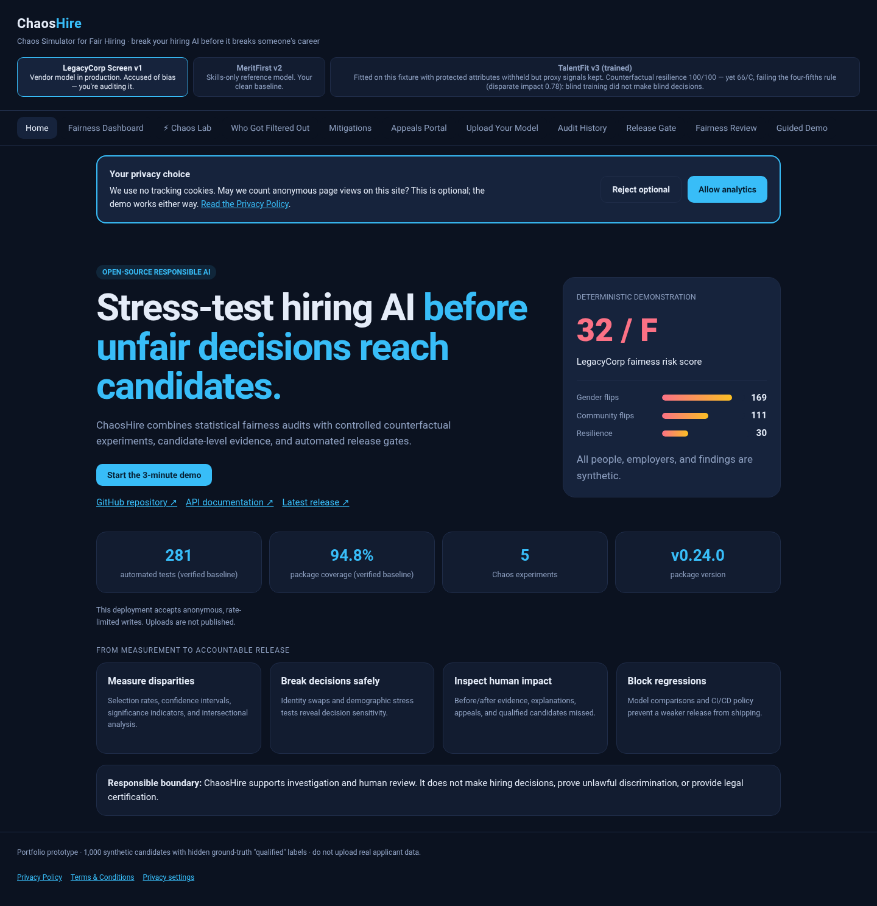

# ChaosHire

### Chaos testing for fair hiring AI

[Live demo](https://chaoshire.onrender.com) · [API docs](https://chaoshire.onrender.com/docs) · [Privacy Policy](chaoshire/web/privacy.html) · [Terms](chaoshire/web/terms.html) · [scikit-learn example](docs/engineering/SCIKIT-LEARN-INTEGRATION.md) · [Portfolio evidence](docs/portfolio/PORTFOLIO-EVIDENCE.md) · [Case study](docs/portfolio/PORTFOLIO-CASE-STUDY.md) · [Architecture](docs/engineering/ARCHITECTURE.svg) · [Methodology](docs/engineering/METHODOLOGY.md) · [Platform](docs/portfolio/PORTFOLIO-PLATFORM.md) · [Monitoring](docs/operations/MONITORING.md) · [Roadmap](docs/planning/PROJECT-ROADMAP.md)

> Netflix breaks its own servers to find weaknesses before customers do. ChaosHire applies the same idea to automated hiring decisions: stress the model safely before unfair behavior affects real candidates.



ChaosHire is an open-source fairness-auditing prototype for hiring models. It combines conventional group-fairness metrics with controlled counterfactual experiments, candidate-level explanations, mitigation simulations, and an appeals workflow.

## Why this project exists

A normal fairness dashboard asks, **“Did groups receive different outcomes?”** ChaosHire also asks, **“Would this exact decision change if only the candidate's identity changed?”**

That second question powers the **Chaos Lab**:

| Test | Controlled experiment | Risk exposed |
|---|---|---|
| Gender-swap counterfactual | Change gender markers; leave qualifications unchanged | Direct or proxy gender influence |
| Name/community swap | Change community signals; preserve the résumé | Name or community discrimination |
| Privilege-keyword injection | Submit deliberately weak, prestige-heavy synthetic résumés | Susceptibility to résumé gaming and class proxies |
| Career-gap stress | Add a career gap to qualified selected candidates | Penalties affecting caregivers and returners |
| Ageing stress | Re-submit selected younger candidates as 50+ | Hidden age penalties |

Each experiment produces a `PASS`, `WARN`, or `FAIL`. Together they form a 0–100 **Chaos Resilience Score**.

On the shipped fixtures the privilege-keyword injection verdict is labelled
**fixture-limited** (in the API payload, next to the badge in the Chaos Lab, and
in `docs/engineering/CONTINUOUS-FAIRNESS.md`): those résumés cannot clear the decision
threshold at the fixtures' prestige weight, so the PASS records how much
headroom exists rather than general resistance to résumé gaming. The label
changes no verdict and no resilience point.

Passes that **cannot fail** for the model under test are labelled **by
construction** in the same way. If a model carries no weight on gender markers,
a gender swap cannot change a single score, so its PASS shows the model does not
read gender directly. It says nothing about whether groups receive equal
outcomes. MeritFirst and TalentFit each have four such passes. Every
`/api/chaos` payload reports `by_construction` per test plus
`passes_by_construction` and a `resilience_scope` sentence for the suite. These
labels change no verdict and no resilience point either.

## Demonstration results

The built-in demonstration uses a deterministic synthetic population of 1,000 candidates and **three selectable model variants**. `legacy` and `fair` are hand-authored scoring fixtures; `trained` is fitted with scikit-learn at build time and loaded from a pinned artifact at runtime (no scikit-learn runtime dependency).

| Model (API/CLI ID) | Purpose | Fairness risk score | Chaos resilience |
|---|---|---:|---:|
| **LegacyCorp Screen v1** (`legacy`) | Intentionally biased test fixture | **32 / F** | **30 / 100** |
| **MeritFirst v2** (`fair`) | Merit-based control fixture | **84 / B** | **100 / 100** |
| **TalentFit v3 (trained)** (`trained`) | Logistic regression fitted to the `qualified` label, protected attributes withheld | **66 / C** | **100 / 100** |

All three appear in the dashboard's model selector. With the app running locally, audit each variant by its ID:

```bash
curl 'http://localhost:8000/api/audit?model=legacy&dataset=demo'
curl 'http://localhost:8000/api/audit?model=fair&dataset=demo'
curl 'http://localhost:8000/api/audit?model=trained&dataset=demo'
```

The LegacyCorp fixture produces:

- **16.9%** decision flips under gender swapping
- **11.1%** decision flips under name/community swapping
- **32.7%** newly rejected hires under the ageing stress test
- **42** qualified candidates incorrectly rejected
- A simulated mitigation improvement from **32/F to 80/B** using blind screening plus proxy removal

TalentFit v3 is the more interesting fixture because it defeats a naive reading of
the leaderboard. It is the **most accurate** of the three models (it agrees with
the `qualified` label on 89.4% of candidates, against 87.3% for MeritFirst and
75.7% for LegacyCorp) and has **resilience 100/100**. Yet it scores **66/C** and
fails the four-fifths rule, with a **worst disparate impact of 0.727** (age band:
50+ candidates are selected at 73% of the 26–35 rate; gender is 0.78). Its
coefficients are pinned in `chaoshire/artifacts/trained_model.json` with a
SHA-256 digest; `python -m chaoshire train --check` re-derives them and fails CI
if they drift (agreement floor 0.90).

### Why the trained model scores below MeritFirst

"Trained" does not mean "fairer". The logistic regression is fitted to agree with
the `qualified` label, and nothing in its objective mentions fairness. On this
fixture, predicting the label well and scoring well on group fairness pull in
different directions:

1. **The label itself is uneven across groups.** `qualified` is the top 40% of a
   merit formula built only from skills, experience, education and
   certifications. Those are drawn independently of identity, but with 1,000
   candidates the groups end up with different qualified rates by sampling
   chance: 45% of women, 37% of men and 30% of the 57 non-binary candidates. A
   **perfect predictor** that accepts exactly the qualified candidates scores
   **68/C**, with worst disparate impact **0.663**. The more closely a model
   copies the label, the more of that gap it inherits.
2. **The score mostly rewards equal selection rates.** Sixty of the 85 points
   (disparate impact plus the parity gap) compare selection rates only. When
   base rates differ, a model cannot be both perfectly accurate and give every
   group the same selection rate.
3. **How many candidates a model selects moves the score.** There are 400
   qualified candidates. MeritFirst accepts 459 and TalentFit 376, and accepting
   more narrows the ratios between groups. With both held to the same number the
   gap mostly closes: MeritFirst at 376 accepted scores 75, TalentFit at 459
   scores 73.

The retained "neutral" features do **not** explain the result. College prestige
and career gap get near-zero weights (+0.012 and +0.030; the positive gap weight
is a chance correlation, not a signal) because the label never uses them.
Zeroing them changes 23 of 1,000 decisions, and **retraining without them makes
the audit worse (58/D)**. The resilience is also structural: a model with no
protected inputs cannot flip on a protected-attribute swap. That is why
measuring both matters. A model can pass every perturbation ChaosHire generates
and still select one group at 73% of another's rate.

All of this is computed at runtime by `chaoshire.training.disparity_diagnostics()`,
served in step 7 of the guided demo (`/api/demo`), and pinned by
`tests/core/test_trained_model.py`. See
[METHODOLOGY.md](docs/engineering/METHODOLOGY.md#why-a-more-accurate-model-can-score-lower).

These are reproducible **synthetic demonstration results**, not findings about a real employer. The model names are fictional.

> **Responsible-use boundary:** The fairness risk score is a transparent heuristic for investigation and human review. It is not an independent certification, does not establish legal compliance, and does not by itself prove or disprove discrimination. The public API retains the historical `certificate` JSON key and `--min-certificate` CLI option for backward compatibility.

### How the score is computed

`total = measured / available × 100` over group-fairness components only:

| Component | Points |
|---|---:|
| Disparate impact (four-fifths rule) | 40 |
| Demographic parity gap | 20 |
| Equal opportunity gap | 25 |
| **Available with ground-truth qualification labels** | **85** |
| **Available without them** (equal opportunity is not measurable) | **60** |

Two properties follow, and both are stated in every `certificate` payload rather
than left for a reader to infer:

- **Nothing is awarded for free.** Earlier versions added an unconditional 15
  "transparency" points for disclosure, release gates, CI and appeal routes.
  None of that is a property of the model under audit and none of it was ever
  measured, so it gave a badly biased model 47/D instead of 32/F and capped a
  perfect one at 85. Those points are gone; a perfect group-fairness result now
  scores 100/A on merit. The platform capabilities are still disclosed — as
  `platform_disclosure` text, with `scored: false`.
- **The denominator is part of the result.** `basis` is `"full"` (85 available
  points) or `"selection-rate-only"` (60), `available_points` and
  `measured_points` are reported, `unmeasured_components` names what could not
  be measured and why, and `comparable_with_full_basis` is `false` whenever the
  score rests on less evidence. A 60-point-basis score must not be ranked
  against an 85-point-basis score; the HTML and PDF reports say so in the same
  place they print the number.

## Product capabilities

- Group audits for gender, ethnicity/community and age band
- Disparate impact using the four-fifths threshold
- Demographic-parity and equal-opportunity gaps
- 95% Wilson confidence intervals for selection and true-positive rates
- Exploratory highest-vs-lowest two-proportion significance tests
- Pairwise intersectional audits such as gender × age band
- Minimum-cell-size warnings for unreliable group comparisons
- Strict reference-model and dataset validation: unknown identifiers return HTTP 400, never a substituted audit
- Explicit "not assessable" verdicts when decisions show no variation or groups are too small to compare
- Reusable counterfactual and stress-test framework with configurable thresholds
- Deterministic experiment IDs and candidate-level before/after evidence
- Side-by-side model-version comparison and automated CI/CD fairness release gate
- Deterministic evidence-grounded fairness review with prioritized human actions (a transparent rules engine — not an AI agent or language model)
- Pluggable decision-adapter contract for reference, CSV, and production providers
- Tamper-evident SHA-256 evidence bundles with verification API and CLI
- Self-contained HTML reports plus dependency-free native PDF summaries
- API-key write protection, request-size limits, separate read and write rate limits, a nonce-based Content-Security-Policy, a bounded appeal queue, and operational metrics
- Accessible mobile/PWA shell and a stable three-minute guided portfolio demo
- Candidate-level additive explanations
- Blind-screening and proxy-removal simulations, plus a research-only per-group threshold contrast that is refused by default and cites [42 U.S.C. § 2000e-2(l)](https://www.law.cornell.edu/uscode/text/42/2000e-2)
- Candidate decision lookup and appeals workflow
- Configurable CSV audits without exposing model weights
- Custom decision, qualification, candidate-ID, and protected-attribute columns
- Configurable favorable values and minimum reliable group size
- Downloadable JSON audit evidence
- Named audit IDs and SQLite-backed aggregate audit history
- Privacy-conscious storage: uploaded candidate rows are never written to history
- Responsive, dependency-free web dashboard

## Architecture

[View the architecture diagram](docs/engineering/ARCHITECTURE.svg).

```text
Browser (vanilla HTML/CSS/JS)
             │ JSON/HTTP
             ▼
      FastAPI route layer
             │
     Application services
      ├── fairness metrics
      ├── chaos experiments
      ├── explanations
      ├── mitigations
      └── appeals / uploads
             │
 Reference models + synthetic data
             │
       NumPy + Pandas
```

### Repository layout

```text
backend.py                 # stable uvicorn backend:app compatibility entry point
chaoshire/                 # importable application; existing module paths stay stable
├── app.py, schemas.py     # HTTP routes and request contracts
├── services.py, demo.py   # workflows and guided demonstration
├── metrics.py, chaos.py   # fairness calculations and experiments
├── models.py, data.py     # synthetic reference models and fixtures
├── repository*.py         # SQLite and optional PostgreSQL persistence
├── artifacts/             # pinned trained-model fixture
└── web/                   # packaged browser shell (served at /)
    ├── index.html
    └── static/            # stylesheet and PWA icons
tests/
├── api/                   # endpoints, uploads, and access controls
├── core/                  # metrics, models, and fairness workflows
├── infrastructure/        # repositories, connectors, and build checks
├── web/                   # HTML/CSS, CSP, and escaping
└── browser/               # opt-in Playwright suite
docs/
├── engineering/           # architecture, methodology, integration
├── operations/            # persistence, monitoring, releases
├── portfolio/             # case study, evidence, and screenshots
└── planning/              # roadmap and historical task log
scripts/                   # CI checks, icon/screenshot generators, live probes
examples/                  # runnable decision-adapter example
.github/workflows/         # quality, browser, fairness, security, release CI
```

See the [documentation index](docs/README.md) for individual files and maintenance
commands. `backend.py`, dependency manifests, `Dockerfile`, `render.yaml`, and the
standard community files remain at the root for existing deployment and tooling
conventions. The Python modules remain at their public `chaoshire.*` import paths;
the web assets are resolved relative to the package rather than the working
directory.

## Quick start

### Option 1 — Python

```bash
git clone https://github.com/dommetipavan26-tech/chaoshire.git
cd chaoshire
python -m venv .venv

# Linux/macOS
source .venv/bin/activate
# Windows PowerShell: .venv\Scripts\Activate.ps1

python -m pip install -r requirements.txt
python -m uvicorn backend:app --reload
```

Open <http://localhost:8000>. Interactive API documentation is available at <http://localhost:8000/docs>.

### Option 2 — Docker

```bash
docker build -t chaoshire .
docker run --rm -p 8000:8000 chaoshire
```

Aggregate audit history defaults to `data/chaoshire.db`. Override it with `CHAOSHIRE_DB_PATH`; see [Persistence & privacy](docs/operations/PERSISTENCE.md). Render's free filesystem is ephemeral, so the public demo's history is not durable across redeploys.

The website has privacy and terms pages, SEO and social-sharing metadata, a small-screen layout, and one primary action: **Start the 3-minute demo**. It uses no tracking cookies. Anonymous, first-party page-view counts are sent only after an explicit analytics opt-in and are available only to a server-side operator; they reset on restart. No operator key is embedded in the browser. The hand-managed live deployment may lag this source revision until the owner deploys it; see [website readiness and page-speed checks](docs/operations/WEBSITE-READINESS.md) for verification, limitations, and deployment steps.

### Run tests

```bash
python -m pip install -r requirements-dev.txt
python -m pytest -q               # API, core, infrastructure, and web tests
```

The optional Playwright suite lives in `tests/browser/`; its install and run
commands are in the [documentation index](docs/README.md). GitHub Actions runs
linting, type checking, the trained-model drift check and the default test suite
on Python 3.11 and 3.12; a separate workflow runs the browser tests. The
quality gate requires at least 90% package coverage; the **current source
baseline**, measured locally, contains **289 tests with 94.9% package coverage**
(the configured source set excludes the synthetic fixture module
`chaoshire/data.py`). The tagged release and live site may lag this revision.

`chaoshire/build_info.py` is the single source of truth for every number the
landing page and this README quote. Version, model count, experiment count and
fixture size are derived from the running package at import time, so they cannot
drift. The test count and coverage figure cannot be derived that way, so
`scripts/check_build_info.py` re-derives both from a real pytest run and fails
the build if `chaoshire/build_info.py` disagrees. `GET /api/meta` serves the
result as `build`, and `chaoshire/web/index.html` renders that payload instead
of hardcoding a version string — the failure mode that once left the landing page advertising
v0.21.0 while the package said v0.22.0.

### Audit scikit-learn predictions

A runnable example trains a deterministic logistic-regression pipeline on synthetic data, normalizes its predictions through the `DecisionAdapter` contract, and prints group-audit results:

```bash
python -m pip install -r requirements-examples.txt
python -m examples.sklearn_decision_adapter
```

See the [scikit-learn integration guide](docs/engineering/SCIKIT-LEARN-INTEGRATION.md) for the data contract, adaptation steps, and responsible-use limits.

### Continuous fairness commands

```bash
# exits 0 when the candidate passes, 1 when the release must be blocked
python -m chaoshire gate --baseline legacy --candidate fair \
  --min-certificate 75 --min-resilience 80 --min-di 0.80

# self-contained HTML report
python -m chaoshire report --model legacy --output chaoshire-report.html

# native PDF summary
python -m chaoshire report --model legacy --format pdf --output chaoshire-report.pdf

# deterministic fairness review and tamper-evident evidence bundle
python -m chaoshire review --model legacy
python -m chaoshire evidence --model legacy --output chaoshire-evidence.json
```

The gate example compares `legacy` with `fair`; it is not the full model list.
Use `--candidate trained` to evaluate the third variant (it may be blocked by
the example thresholds). The `report`, `review`, and `evidence` commands accept
`--model legacy`, `--model fair`, or `--model trained`.

See [Continuous fairness engineering](docs/engineering/CONTINUOUS-FAIRNESS.md) for the test contract, experiment fingerprints, evidence format, comparison API, and CI policy.

## Audit your own decisions

The upload workflow accepts a CSV containing model **outcomes**, so a vendor does not need to expose weights or source code.

The minimum input is one outcome column and one group attribute. Their names and values are configurable in the UI or API:

```csv
person_id,region,disability_status,outcome,job_ready
A-001,north,no,advance,qualified
A-002,south,yes,reject,qualified
```

For this example, configure:

- Decision column: `outcome`
- Favorable value: `advance`
- Qualification column: `job_ready` (optional; enables equal-opportunity analysis)
- Qualified value: `qualified`
- Protected attributes: `region, disability_status`
- Minimum reliable group size: `30` by default, configurable from 2–500

Column names are normalized for surrounding whitespace and case. Missing group values are retained as a visible `(missing)` group instead of silently discarded. High-cardinality fields that look like identifiers are rejected as protected attributes. Each successful upload returns its interpretation settings and warnings, and `/api/audit/export` downloads the result as JSON.

The original schema remains backward-compatible. Download a compatible synthetic sample from `/api/sample.csv`.

## Three-minute walkthrough

1. Open **LegacyCorp Screen v1** and note its **32/F** risk score — and the scoring-basis line beside it, which says the score is 27.1 of 85 available points measured.
2. Open **Chaos Lab** and run the suite; explain the 16.9% gender-swap flip rate.
3. Open **Who Got Filtered Out** and show the 42 qualified rejected candidates.
4. Apply both mitigations and compare **32/F with 80/B**. Note the panel explaining why per-group threshold "calibration" is *not* one of them, with the statute cited.
5. Switch to **MeritFirst v2** (**84/B**, resilience 100/100) to show a cleaner synthetic fixture under the same tests; these results are not a certification.
6. Switch to **TalentFit v3** (**66/C**, resilience 100/100, worst disparate impact 0.727 on age band). It is the most accurate model of the three and still fails the four-fifths rule, because it learned group gaps already present in its training label, and a perfect copy of that label scores 68/C. Its passes are labelled *by construction*: with no protected inputs it cannot flip on a swap. This step shows why neither accuracy nor resilience is a fairness result.
7. In **Appeals**, look up `C-1046`; the system identifies a likely qualified rejection and prioritizes the appeal.

## Methodology and limitations

ChaosHire is an educational and portfolio-grade prototype—not a legal compliance certification service.

- The built-in dataset and models are synthetic.
- Observed disparity is evidence requiring investigation; it does not by itself prove unlawful discrimination.
- The four-fifths threshold is a screening heuristic, not a universal definition of fairness.
- Equal-opportunity analysis depends on trustworthy qualification labels.
- Per-group threshold calibration is **not offered as a mitigation**. Setting different cutoff scores by race, colour, religion, sex or national origin in an employment test is an unlawful employment practice under [42 U.S.C. § 2000e-2(l)](https://www.law.cornell.edu/uscode/text/42/2000e-2) (Civil Rights Act of 1991). ChaosHire can still compute it as a labelled research contrast — `threshold_contrast_acknowledged=true`, refused otherwise, reported under its own key and never merged into a mitigation result — but nothing here is legal advice.
- The current in-memory upload and appeals state is not suitable for sensitive production data.
- The public demonstration keeps a single shared upload slot, so the latest upload's aggregate result is readable by every visitor; raw rows never leave process memory.
- Real deployments require privacy assessment, access controls, encryption, retention policies, monitoring, and legal review.

## Roadmap

- [x] Deterministic reference models and fairness audit
- [x] Counterfactual Chaos Lab
- [x] Explanations, mitigation simulations and appeals
- [x] Public deployment, automated tests and container support
- [x] Configurable CSV schema and protected attributes
- [x] Statistical uncertainty and pairwise intersectional fairness analysis
- [x] Named SQLite-backed aggregate audit history
- [x] Model-version comparison and regression gates for CI/CD
- [x] Self-contained HTML and native PDF report export
- [x] Deterministic evidence-grounded fairness review and verified evidence bundles
- [x] Pluggable decision-source adapters
- [x] Optional API-key protection, platform safeguards, metrics, PWA, and guided demo
- [x] Authenticated remote REST connector and SHAP-compatible explanations
- [x] Optional PostgreSQL repository adapter (SQLite remains the default)
- [ ] User accounts, role-based access, and a configured durable deployment

## Responsible use

Do not upload real applicant data to the public demonstration. Use synthetic or properly anonymized data only. ChaosHire should support—not replace—qualified human, statistical, legal and domain review.

## License

Released under the [MIT License](LICENSE).
