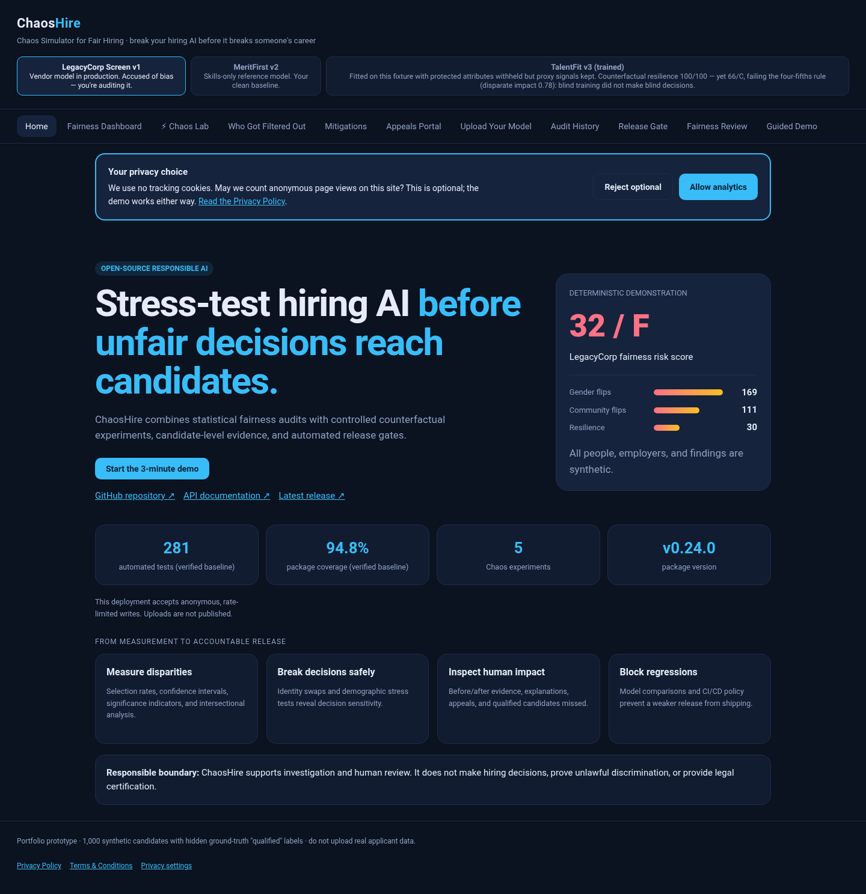
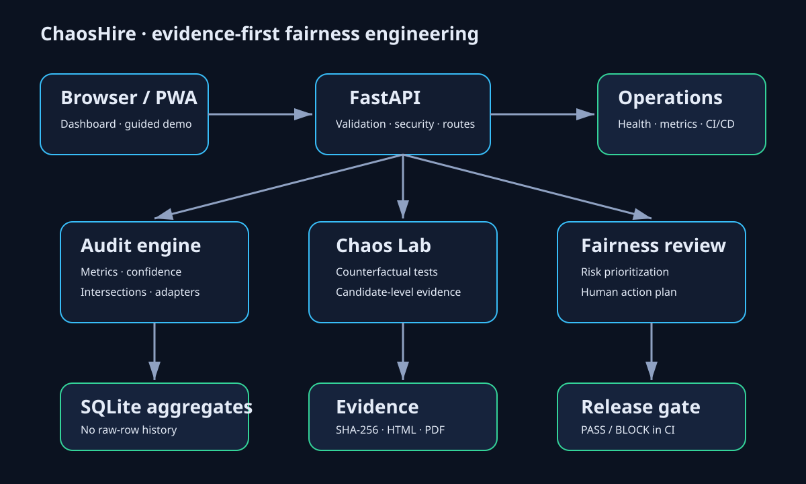

# ChaosHire

### Chaos testing for fair hiring AI

[Live demo](https://chaoshire.onrender.com) · [API docs](https://chaoshire.onrender.com/docs) · [Privacy Policy](chaoshire/web/privacy.html) · [Terms](chaoshire/web/terms.html) · [scikit-learn example](docs/engineering/SCIKIT-LEARN-INTEGRATION.md) · [Portfolio evidence](docs/portfolio/PORTFOLIO-EVIDENCE.md) · [Case study](docs/portfolio/PORTFOLIO-CASE-STUDY.md) · [Architecture](#architecture) · [Methodology](docs/engineering/METHODOLOGY.md) · [Platform](docs/portfolio/PORTFOLIO-PLATFORM.md) · [Monitoring](docs/operations/MONITORING.md) · [Roadmap](docs/planning/PROJECT-ROADMAP.md)

> Netflix breaks its own servers to find weaknesses before customers do. ChaosHire applies the same idea to automated hiring decisions: stress the model safely before unfair behavior affects real candidates.



ChaosHire is an open-source fairness-auditing prototype for hiring models. It combines conventional group-fairness metrics with controlled counterfactual experiments, candidate-level explanations, mitigation simulations, and an appeals workflow.

## Why this project exists

A normal fairness dashboard asks, **“Did groups receive different outcomes?”** ChaosHire also asks, **“Would this exact decision change if only the candidate's identity changed?”**

That second question powers the **Chaos Lab**:

| Test | Controlled experiment | Risk exposed |
|---|---|---|
| Gender-swap counterfactual | Change gender markers; leave qualifications unchanged | Direct or proxy gender influence |
| Name/community swap | Change community signals; preserve the résumé | Name or community discrimination |
| Privilege-keyword injection | Submit deliberately weak, prestige-heavy synthetic résumés | Susceptibility to résumé gaming and class proxies |
| Career-gap stress | Add a career gap to qualified selected candidates | Penalties affecting caregivers and returners |
| Ageing stress | Re-submit selected younger candidates as 50+ | Hidden age penalties |

Each experiment produces a `PASS`, `WARN`, or `FAIL`. Together they form a 0–100 **Chaos Resilience Score**.

On the shipped fixtures the privilege-keyword injection verdict is labelled
**fixture-limited** (in the API payload, next to the badge in the Chaos Lab, and
in `docs/engineering/CONTINUOUS-FAIRNESS.md`): those résumés cannot clear the decision
threshold at the fixtures' prestige weight, so the PASS records how much
headroom exists rather than general resistance to résumé gaming. The label
changes no verdict and no resilience point.

Passes that **cannot fail** for the model under test are labelled **by
construction** in the same way. If a model carries no weight on gender markers,
a gender swap cannot change a single score, so its PASS shows the model does not
read gender directly. It says nothing about whether groups receive equal
outcomes. MeritFirst and TalentFit each have four such passes. Every
`/api/chaos` payload reports `by_construction` per test plus
`passes_by_construction` and a `resilience_scope` sentence for the suite. These
labels change no verdict and no resilience point either.

## Demonstration results

The built-in demo uses a deterministic synthetic population of 1,000 candidates and
**three selectable model variants**. `legacy` and `fair` are hand-authored scoring
fixtures; `trained` is fitted with scikit-learn at build time and loaded from a pinned
artifact at runtime (no scikit-learn runtime dependency).

### Model comparison

| Model (API/CLI ID) | Purpose | Fairness risk score | Chaos resilience |
|---|---|---:|---:|
| **LegacyCorp Screen v1** (`legacy`) | Intentionally biased test fixture | **32 / F** | **30 / 100** |
| **MeritFirst v2** (`fair`) | Merit-based control fixture | **84 / B** | **100 / 100** |
| **TalentFit v3 (trained)** (`trained`) | Logistic regression on merit features with a cost-sensitive cutoff; protected attributes and proxies withheld | **80 / B** | **100 / 100** |

All three appear in the dashboard's model selector. With the app running locally, audit each variant by its ID:

```bash
curl 'http://localhost:8000/api/audit?model=legacy&dataset=demo'
curl 'http://localhost:8000/api/audit?model=fair&dataset=demo'
curl 'http://localhost:8000/api/audit?model=trained&dataset=demo'
```

### LegacyCorp stress-test snapshot

On the intentionally biased fixture, Chaos Lab reports:

- **16.9%** decision flips under gender swapping
- **11.1%** decision flips under name/community swapping
- **32.7%** newly rejected candidates under the ageing stress test
- **42** qualified candidates incorrectly rejected

The dashboard also simulates blind screening plus proxy removal as a mitigation; this
illustrative what-if is not a guarantee about real hiring outcomes.

### Trained model and score summary

TalentFit v3 is the fitted model, not another hand-authored fixture. Its original version
was trained on the synthetic qualification label. It achieved higher label agreement
than the upgraded version, but also had a weaker group-fairness result. The current
version drops college-prestige and career-gap proxies and uses one global,
cost-sensitive cutoff, trading some precision for recall without per-group thresholds.
The original-versus-upgraded comparison, rationale, 49-population holdout, and
trade-offs are in [the methodology guide](docs/engineering/METHODOLOGY.md#why-a-more-accurate-model-can-score-lower).
The model artifact is pinned and checked by `python -m chaoshire train --check`.

The Fairness Risk Score summarizes disparate-impact, demographic-parity and—when
supportable—equal-opportunity evidence. Assessable results report measured and available
points plus their `full` or `selection-rate-only` basis; scores on different bases are
not directly comparable. Unassessable results are identified separately. See
[METHODOLOGY.md](docs/engineering/METHODOLOGY.md#fairness-risk-score) for the formula
and component rules. These reproducible results use synthetic data and
fictional model names; they are not findings about real employers or a certification
of legal compliance.

## Product capabilities

### Auditing and fairness metrics

- Group audits for gender, ethnicity/community and age band
- Disparate impact using the four-fifths threshold
- Demographic-parity and equal-opportunity gaps
- 95% Wilson confidence intervals for selection and true-positive rates
- Exploratory highest-vs-lowest two-proportion significance tests
- Pairwise intersectional audits such as gender × age band
- Minimum-cell-size warnings for unreliable group comparisons, applied to a group's
  rows **and** to the qualified people behind its true-positive rate
- Explicit "not assessable" verdicts when decisions show no variation or groups are too
  small to compare

### Chaos testing and candidate review

- Reusable counterfactual and stress-test framework with configurable thresholds
- Deterministic experiment IDs and candidate-level before/after evidence
- Candidate-level additive explanations
- Candidate decision lookup and appeals workflow
- Blind-screening and proxy-removal simulations, plus a research-only per-group
  threshold contrast that is refused by default and cites
  [42 U.S.C. § 2000e-2(l)](https://www.law.cornell.edu/uscode/text/42/2000e-2)

### Reporting and governance

- Side-by-side model-version comparison and automated CI/CD fairness release gate
- Deterministic evidence-grounded fairness review with prioritized human actions (a
  transparent rules engine—not an AI agent or language model)
- Tamper-evident SHA-256 evidence bundles with verification API and CLI
- Self-contained HTML reports plus dependency-free native PDF summaries
- Downloadable JSON audit evidence

### Data and integrations

- Pluggable decision-adapter contract for reference, CSV, and production providers
- Configurable CSV audits without exposing model weights
- Custom decision, qualification, candidate-ID, and protected-attribute columns
- Configurable favorable values and minimum reliable group size
- Named audit IDs and SQLite-backed aggregate audit history
- Privacy-conscious storage: uploaded candidate rows are never written to history

### Operations, security and experience

- Strict reference-model and dataset validation: unknown identifiers return HTTP 400, never a substituted audit
- API-key write protection, request-size limits, separate read and write rate limits, a
  nonce-based Content-Security-Policy, a bounded appeal queue, and operational metrics
- Accessible mobile/PWA shell and a stable three-minute guided portfolio demo
- Responsive, dependency-free web dashboard

## Architecture

A browser-based shell calls FastAPI, which orchestrates audits, chaos experiments,
candidate explanations, reports, evidence, and operations.



[Open the architecture SVG source](docs/engineering/ARCHITECTURE.svg).

### Repository layout

```text
backend.py                 # stable uvicorn backend:app compatibility entry point
chaoshire/                 # importable application; existing module paths stay stable
├── app.py, schemas.py     # HTTP routes and request contracts
├── services.py, demo.py   # workflows and guided demonstration
├── metrics.py, chaos.py   # fairness calculations and experiments
├── models.py, data.py     # synthetic reference models and fixtures
├── repository*.py         # SQLite and optional PostgreSQL persistence
├── artifacts/             # pinned trained-model fixture
└── web/                   # packaged browser shell (served at /)
    ├── index.html        # semantic markup; legal and 404 pages alongside it
    └── static/            # chaoshire.css, chaoshire.js, licensed font, PWA icons
tests/
├── api/                   # endpoints, uploads, and access controls
├── core/                  # metrics, models, and fairness workflows
├── infrastructure/        # repositories, connectors, and build checks
├── web/                   # HTML/CSS/JS, asset cache, CSP, and escaping
└── browser/               # opt-in Playwright suite
docs/
├── engineering/           # architecture, methodology, integration
├── operations/            # persistence, monitoring, releases
├── portfolio/             # case study, evidence, and screenshots
└── planning/              # roadmap and historical task log
scripts/                   # CI checks, icon/screenshot generators, live probes
examples/                  # runnable decision-adapter example
.github/workflows/         # quality, browser, fairness, security, release CI
```

See the [documentation index](docs/README.md), the [file-by-file inventory](docs/operations/REPOSITORY-INVENTORY.md),
and the [1 October 2026 audit, with its 2 October hosted-CI follow-up](docs/operations/REPOSITORY-AUDIT.md)
for individual files, verification scope, and maintenance commands. `backend.py`, dependency manifests, `Dockerfile`, `render.yaml`, and the
standard community files remain at the root for existing deployment and tooling
conventions. The Python modules remain at their public `chaoshire.*` import paths;
the web assets are resolved relative to the package rather than the working
directory.

## Quick start

### Option 1 — Python

```bash
git clone https://github.com/dommetipavan26-tech/chaoshire.git
cd chaoshire
python -m venv .venv

# Linux/macOS
source .venv/bin/activate
# Windows PowerShell: .venv\Scripts\Activate.ps1

python -m pip install -r requirements.txt
python -m uvicorn backend:app --reload
```

Open <http://localhost:8000>. Interactive API documentation is available at <http://localhost:8000/docs>.

### Option 2 — Docker

```bash
docker build -t chaoshire .
docker run --rm -p 8000:8000 chaoshire
```

Aggregate audit history defaults to `data/chaoshire.db`. Override it with `CHAOSHIRE_DB_PATH`; see [Persistence & privacy](docs/operations/PERSISTENCE.md). Render's free filesystem is ephemeral, so the public demo's history is not durable across redeploys.

The website has privacy and terms pages, SEO and social-sharing metadata, a small-screen layout, and one primary action: **Start the 3-minute demo**. It uses no tracking cookies. Anonymous, first-party page-view counts are sent only after an explicit analytics opt-in and are available only to a server-side operator; they reset on restart. No operator key is embedded in the browser. The hand-managed live deployment may lag this source revision until the owner deploys it; see [website readiness and page-speed checks](docs/operations/WEBSITE-READINESS.md) for verification, limitations, and deployment steps.

### Run tests

```bash
python -m pip install -r requirements-dev.txt
python -m pytest -q               # API, core, infrastructure, and web tests
```

The optional Playwright suite lives in `tests/browser/`; its install and run
commands are in the [documentation index](docs/README.md). GitHub Actions runs
linting, type checking, the trained-model drift check and the default test suite
on Python 3.11 and 3.12; a separate workflow runs the browser tests. The
quality gate requires at least 90% package coverage; the **current source
baseline**, measured locally on **CPython 3.11.2**, contains
**504 tests with 97.1% package coverage**
(the configured source set excludes the synthetic fixture module
`chaoshire/data.py`). The tagged release and live site may lag this revision.

`chaoshire/build_info.py` is the single source of truth for every number the
landing page and this README quote. Version, model count, experiment count and
fixture size are derived from the running package at import time, so they cannot
drift. The test count and coverage figure cannot be derived that way, so
`scripts/check_build_info.py` re-derives both from a real pytest run and fails
the build if `chaoshire/build_info.py` disagrees. `GET /api/meta` serves the
result as `build`, and `chaoshire/web/static/chaoshire.js` renders that payload instead
of hardcoding a version string — the failure mode that once left the landing page advertising
v0.21.0 while the package said v0.22.0.

### Optional integrations and reproducible checks

```bash
# Linux / Python 3.11 development; use requirements-py312.txt for Python 3.12
python -m pip install -c constraints/requirements-py311.txt -r requirements-dev.txt
# Optional PostgreSQL runtime driver (SQLite remains default)
python -m pip install ".[postgres]"
# Optional asset/audit/constraint-generation tools
python -m pip install -r requirements-maintenance.txt
# Fresh-wheel verification after `python -m build`
python scripts/check_distribution.py --wheel dist/chaoshire-*.whl --sdist dist/chaoshire-*.tar.gz \
  --constraints constraints/requirements-py311.txt
```

The [repository audit and hosted verification](docs/operations/REPOSITORY-AUDIT.md)
distinguish local results from owner-only rollout and record CI outcomes by code
revision. Strict decision labels, expiring bounded limiter keys, fixed webhook workers,
and fail-closed benchmark input are implemented. PostgreSQL tests are opt-in
(`tests/integration/`) and require an explicit **disposable local**
`CHAOSHIRE_TEST_POSTGRES_URL`; they never fall back to a production DSN. CI includes
service-backed PostgreSQL, installed-package, and non-default-PORT container checks
alongside the quality matrix.

### Audit scikit-learn predictions

A runnable example trains a deterministic logistic-regression pipeline on synthetic data, normalizes its predictions through the `DecisionAdapter` contract, and prints group-audit results:

```bash
python -m pip install -r requirements-examples.txt
python -m examples.sklearn_decision_adapter
```

### Audit real-world data (UCI Adult)

The same audit engine runs on a real public benchmark, the 1994 US Census
income data (15,060 held-out people), comparing a naive model, a blind model
with proxies removed, and the true label itself:

```bash
python -m examples.adult_income_audit
```

Headline: even a *perfect* predictor of the real label fails the four-fifths
rule on sex, race and age (51/D), and blinding sex and race made the age gap
worse until age was removed too. Full results, trade-offs and a limitation this
audit uncovered are in [REAL-DATA-AUDIT.md](docs/engineering/REAL-DATA-AUDIT.md).

See the [scikit-learn integration guide](docs/engineering/SCIKIT-LEARN-INTEGRATION.md) for the data contract, adaptation steps, and responsible-use limits.

### Continuous fairness commands

```bash
# exits 0 when the candidate passes, 1 when the release must be blocked
python -m chaoshire gate --baseline legacy --candidate fair \
  --min-certificate 75 --min-resilience 80 --min-di 0.80

# self-contained HTML report
python -m chaoshire report --model legacy --output chaoshire-report.html

# native PDF summary
python -m chaoshire report --model legacy --format pdf --output chaoshire-report.pdf

# deterministic fairness review and tamper-evident evidence bundle
python -m chaoshire review --model legacy
python -m chaoshire evidence --model legacy --output chaoshire-evidence.json
```

The gate example compares `legacy` with `fair`; it is not the full model list.
Use `--candidate trained` to evaluate the third variant: LegacyCorp → TalentFit
passes, while MeritFirst → TalentFit is blocked by the 4-point score
regression. `python -m chaoshire train --holdout` prints the unseen-population
comparison. The `report`, `review`, and `evidence` commands accept
`--model legacy`, `--model fair`, or `--model trained`.

See [Continuous fairness engineering](docs/engineering/CONTINUOUS-FAIRNESS.md) for the test contract, experiment fingerprints, evidence format, comparison API, and CI policy.

## Audit your own decisions

The upload workflow accepts a CSV containing model **outcomes**, so a vendor does not need to expose weights or source code.

The minimum input is one outcome column and one group attribute. Their names and values are configurable in the UI or API:

```csv
person_id,region,disability_status,outcome,job_ready
A-001,north,no,advance,qualified
A-002,south,yes,reject,qualified
```

For this example, configure:

- Decision column: `outcome`
- Favorable value: `advance`
- Qualification column: `job_ready` (optional; enables equal-opportunity analysis)
- Qualified value: `qualified`
- Protected attributes: `region, disability_status`
- Minimum reliable group size: `30` by default, configurable from 2–500

Column names are normalized for surrounding whitespace and case. Missing group values are retained as a visible `(missing)` group instead of silently discarded. High-cardinality fields that look like identifiers are rejected as protected attributes. Each successful upload returns its interpretation settings, warnings, and aggregate audit. **Anonymous uploads are not published or persisted** (`published: false`, `audit_id: null`); the dashboard's **Download JSON audit** button downloads that exact browser-local result. Only operator-authenticated uploads populate shared history and the latest-upload slot. `/api/audit/export`, HTML/PDF reports, and evidence endpoints refer to that **shared published slot**, not to an anonymous visitor's upload. See [persistence and privacy](docs/operations/PERSISTENCE.md).

The original schema remains backward-compatible. Download a compatible synthetic sample from `/api/sample.csv`.

## Three-minute walkthrough

1. Open **LegacyCorp Screen v1** and note its risk score and measurement-basis line; compare it with the model table above.
2. Run **Chaos Lab** and inspect the counterfactual flips, stress tests, and any *by construction* labels.
3. Open **Who Got Filtered Out** to review candidate-level decisions and explanations.
4. Apply blind screening and proxy removal, then discuss the limits of a synthetic mitigation simulation and why per-group threshold "calibration" is not offered.
5. Compare the three model variants and use the [methodology guide](docs/engineering/METHODOLOGY.md#why-a-more-accurate-model-can-score-lower) to explain TalentFit's training trade-offs.
6. In **Appeals**, look up `C-1046`; the system identifies a likely qualified rejection and prioritizes the appeal.

## Methodology and limitations

ChaosHire is an educational and portfolio-grade prototype—not a legal compliance
certification service. The [engineering methodology](docs/engineering/METHODOLOGY.md)
explains the statistics, score construction, trained-model results, and assumptions
in detail.

- The built-in dataset and models are synthetic.
- Observed disparity is evidence requiring investigation; it does not by itself prove unlawful discrimination.
- The four-fifths threshold is a screening heuristic, not a universal definition of fairness.
- Equal-opportunity analysis depends on trustworthy qualification labels.
- Per-group threshold calibration is **not offered as a mitigation**. Setting different cutoff scores by race, colour, religion, sex or national origin in an employment test is an unlawful employment practice under [42 U.S.C. § 2000e-2(l)](https://www.law.cornell.edu/uscode/text/42/2000e-2) (Civil Rights Act of 1991). ChaosHire can still compute it as a labelled research contrast — `threshold_contrast_acknowledged=true`, refused otherwise, reported under its own key and never merged into a mitigation result — but nothing here is legal advice.
- The current in-memory upload and appeals state is not suitable for sensitive production data.
- The public demonstration keeps a single shared slot for **operator-published** uploads, so the latest published aggregate result is readable by every visitor. Anonymous uploads do not replace that slot; their parsed rows are discarded after the response. Published raw rows stay in process memory only.
- Real deployments require privacy assessment, access controls, encryption, retention policies, monitoring, and legal review.

## Roadmap

- [x] Deterministic reference models and fairness audit
- [x] Counterfactual Chaos Lab
- [x] Explanations, mitigation simulations and appeals
- [x] Public deployment, automated tests and container support
- [x] Configurable CSV schema and protected attributes
- [x] Statistical uncertainty and pairwise intersectional fairness analysis
- [x] Named SQLite-backed aggregate audit history
- [x] Model-version comparison and regression gates for CI/CD
- [x] Self-contained HTML and native PDF report export
- [x] Deterministic evidence-grounded fairness review and verified evidence bundles
- [x] Pluggable decision-source adapters
- [x] Optional API-key protection, platform safeguards, metrics, PWA, and guided demo
- [x] Authenticated remote REST connector and SHAP-compatible explanations
- [x] Optional PostgreSQL repository adapter (SQLite remains the default)
- [ ] User accounts, role-based access, and a configured durable deployment

## Responsible use

Do not upload real applicant data to the public demonstration. Use synthetic or properly anonymized data only. ChaosHire should support—not replace—qualified human, statistical, legal and domain review.

## License

Released under the [MIT License](LICENSE).
